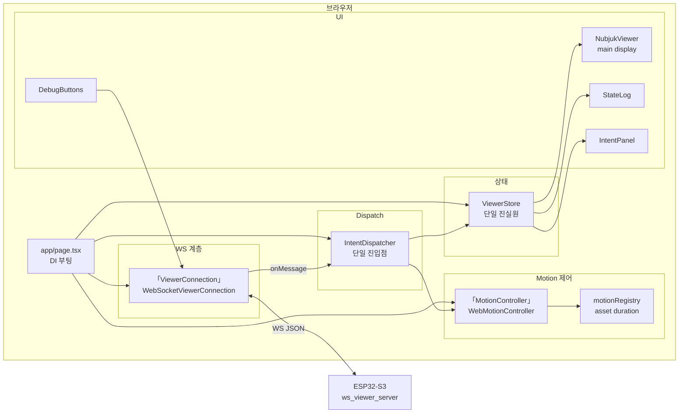
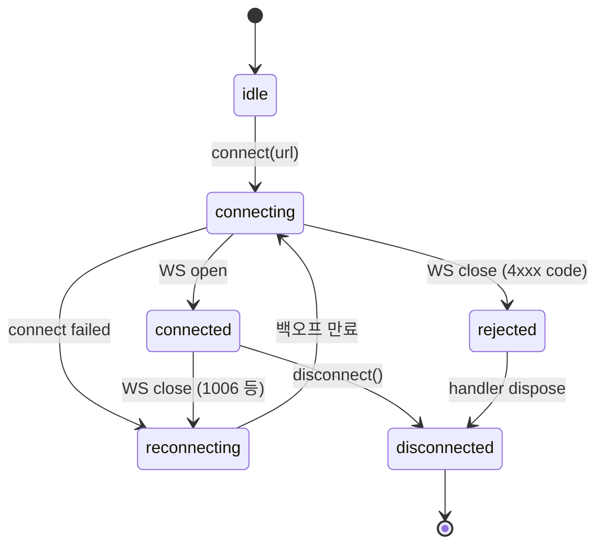
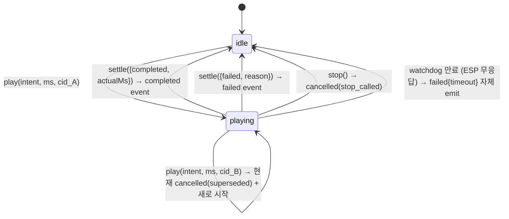

# Viewer — 모듈 아키텍처

ESP의 WS 서버에 연결해 FSM 상태와 motion을 시각화하는 **개발·디버깅 전용** 클라이언트. 마이크 없음. ESP의 거울.

- Phase 2~4: Next.js (web)
- Phase 5~: Unity 3D (web 보존, 디버깅 도구로)
- Phase 6: 양산화 시 폐기 또는 read-only 모드

---

## 컴포넌트 다이어그램 (Phase 2~4 web)



---

## 메시지 dispatch 매트릭스 (IntentDispatcher)

ESP의 모든 push 메시지를 처리. 누락된 type은 protocol error로 분류.

| ESP → viewer 메시지 | 처리 |
|--------------------|------|
| `hello` | store 초기화 (boot_id 비교, 변경 시 전체 reset). connection state = `connected` |
| `state` | store.stateLog에 append (cyclic buffer 20). store.currentState 갱신 |
| `intent` | store.lastIntent 갱신 |
| `motion_started` | motion.play(intent, expectedMs, cid) — controller가 같은 cid면 idempotent, 다른 cid면 superseded 처리 |
| `motion_completed` | 현재 cid 비교 → motion.settle({completed, actualMs}) — ESP가 진실원, stale은 protocolError 기록 후 무시 |
| `motion_failed` | 현재 cid 비교 → motion.settle({failed, reason}) — reason은 ESP가 결정, stale은 protocolError 기록 후 무시 |
| `error` | store.recentMessages에 기록 (dev panel 표시용). UI level toast handler는 별도 |
| `heartbeat` | store.currentState 미러 갱신 (last-received ts 추적은 transport 계층에서 watchdog용) |
| schema 위반 / parse 실패 | ViewerConnection.onProtocolError → store.protocolErrors 카운터 증가 + 콘솔 경고 |

| viewer → ESP 메시지 | 발신 시점 |
|--------------------|----------|
| `subscribe` | connect 후 자동 |
| `ping` | 10초 주기 |
| `manual_trigger` | DebugButtons 클릭 (DEV_MODE 활성 시) |

---

## 연결 라이프사이클



**백오프**: 1s → 2s → 5s → 10s (max 10s). 무한 재시도 (사용자가 disconnect 호출 전까지).

**Tab visibility**: backgrounded 시 백오프 일시 중지. foreground 복귀 시 즉시 재시도.

---

## 상태 모델 (ViewerStore — 단일 진실원)

```typescript
type ViewerStoreState = {
  connectionState: ConnectionState;      // ViewerConnection의 미러
  bootId: string | null;                 // ESP 재부팅 감지용
  currentState: FsmState | null;         // ESP의 마지막 FSM 상태
  lastIntent: IntentMessage | null;
  stateLog: StateTransition[];           // 최근 20개
  protocolErrors: { count: number; recent: string[] };
};
```

**Reset 규칙**:
| 이벤트 | 동작 |
|--------|------|
| `boot_id` 변경 | 전체 store reset (ESP 재부팅) |
| WS `disconnected` | connection만 reset, history 유지 (operator 디버깅) |
| WS `connected` 후 `hello` 수신 | 새 session 가정, stateLog/lastIntent reset |
| `disconnect()` 호출 | connection만 reset |

---

## Motion 라이프사이클 (correlation_id 기반, ESP-as-truth)



**Terminal 권위**: ESP. `motion_completed`/`motion_failed` 메시지가 도달하기 전엔 motion이 *playing* 상태 유지. 로컬 timer는 *watchdog*으로만 작동 — `expectedMs * 2 + grace` 후에도 ESP가 settle 안 하면 자체 `failed{timeout}` emit (네트워크 단절·mcu freeze 보호).

**stale 메시지 거부**:
- ESP에서 `motion_completed{cid: cid_old}` 가 늦게 도착 → IntentDispatcher가 `motion.getCurrentCorrelationId() !== cid_old` 확인 후 settle 호출 X (store에 protocol error 로그)
- 같은 cid로 두 번 play → 두 번째 무시 (idempotent)
- settle()도 cid 불일치 시 no-op (방어적 — dispatcher가 1차 거부 + impl도 재차 검증)

---

## DI 부팅 (`app/page.tsx`)

```typescript
"use client";

const espHost = resolveEspHost();             // query → localStorage → env → modal UI
const conn = new WebSocketViewerConnection(); // ViewerConnection 인터페이스
const motion = new WebMotionController();     // MotionController 인터페이스
const store = createViewerStore();
const dispatcher = new IntentDispatcher(conn, motion, store);

useEffect(() => {
  conn.connect(`ws://${espHost}/viewer`);
  return () => conn.disconnect();
}, []);
```

---

## Phase 5 Unity 교체 (개념 동일)

```diff
- const conn   = new WebSocketViewerConnection();   // TS
- const motion = new WebMotionController();          // TS
+ var conn     = new WebSocketViewerConnection();    // C#, 같은 인터페이스 의미
+ var motion   = new UnityMotionController(animator);// C#
```

`IntentDispatcher`와 `ViewerStore`는 C#으로 1:1 이식. 메시지 dispatch 매트릭스는 동일.

**Parity 테스트**: 동일 ESP 메시지 시퀀스 입력 시 web과 Unity가 같은 store 결과를 만들어야 함.

---

## 외부 경계

```
┌────────────────────────┐
│  viewer (browser/Unity)│
│                        │
│  ViewerConnection ─────┼─── WS ──→ ESP32-S3 (ws_viewer_server)
│                        │           docs/protocol/mcu-viewer.md
└────────────────────────┘
```

**잠금**: protocol 변경은 사용자 승인 필수.

---

## 의도적 제약

- ❌ 마이크 권한 요청 X (ESP가 마이크 소스)
- ❌ 자체 상태 추론 X (ESP가 단일 진실원, viewer는 거울)
- ❌ 자체 timeout 정책 X (ESP의 motion duration 사용)
- ❌ 다중 ESP 동시 연결 X (1 viewer = 1 ESP, 단순화)
- ❌ Persistent 데이터 저장 X (esp_host만 localStorage)
- ❌ Authentication (Phase 5+ / Phase 6 검토)

---

## Phase별 활성 컴포넌트

| Phase | 활성 |
|-------|------|
| 0~1 | 없음 (viewer 디렉토리 미생성) |
| 2 | WebSocketViewerConnection + WebMotionController + IntentDispatcher + ViewerStore + UI |
| 3 | (변경 없음) `motion_failed.reason` 신규 값 UI 반영만 |
| 4 | (변경 없음) `error{brain_unreachable}` 토스트만 |
| 5 | WebMotionController **→ UnityMotionController 교체** (web 보존 가능) |
| 6 | DEV_MODE=n 정책에 따라 폐기 또는 read-only |
